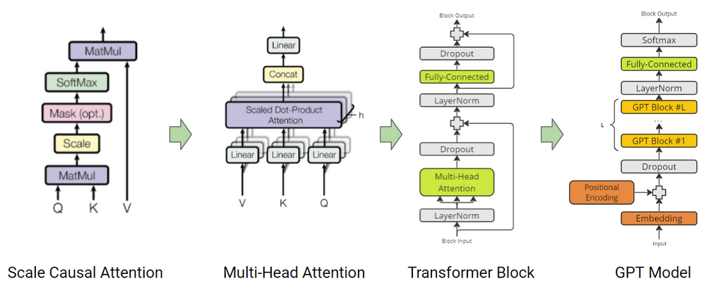

# microGPT  

---
An academic implementation of GPT: only math and JAX

*(This repository was imported from the original functional [`microGPT`](https://github.com/kandarpa02/microGPT.git) by [`Kandarpa Sarkar`](https://github.com/kandarpa02) so the Readme is outdated, we will update this soon!)*

---



**microGPT** is a reflection of how the original **Transformer** layers were engineered back in 2017 at **Google**. This is a **very low-level implementation** of GPT, built entirely from **mathematical equations and JAX**.  
Core components like **Self-Attention**, **Embeddings**, **LayerNorm**, and **Feedforward Networks** are implemented **from scratch**, designed to help newcomers understand the inner workings of **LLMs** — without hiding behind prebuilt abstractions.

---

## Setup

### Installation:
- Clone the repo  
- Navigate to the project directory  
- Install as a package

```bash
git clone https://github.com/deep-spine/ds-microGPT.git
cd microGPT
pip install .
```

### Dependencies:
- Install required packages

```bash
pip install -r requirements.txt
```

---

## User Instructions

### Understanding the Modules:

The core GPT stacks are located in [gpt_micro.py](microGPT/stack/gpt_micro.py).  
You'll find `micro_gpt_1`, `micro_gpt_2`, and `micro_gpt_4`. The earlier versions were used for experimentation with smaller datasets like [openwebtext10k](https://huggingface.co/datasets/stas/openwebtext-10k). These small models demonstrate the feasibility of running compact transformers on resource-constrained devices for tasks such as grocery chatbots, smart-watch autocomplete, and more.

---

### Experiment 1:
Our main focus in this project is `micro_gpt_4` (17M parameters), trained on **TPU v3-8** using a reduced version of OpenWebText (~1GB), hosted [here](https://www.kaggle.com/datasets/kandarpasarkar/openwebtext1g) — about **2.22% of the full corpus**. We trained the model for 60 epochs and achieved a perplexity of approximately `PPL 17.85`.  
However, this model underfits due to a lack of depth.

---

### Experiment 2 (Final):
Later, we applied the scaling laws from DeepMind’s 2022 paper:  
[Training Compute-Optimal Large Language Models](https://arxiv.org/abs/2203.15556).  

We found that the **10M** parameter version of `micro_gpt_4` is optimal for `openwebtext10k`, while a proper fit for the 1GB dataset would require a **350M+** parameter model.  
After pretraining for 74 epochs, the best version achieved around `PPL 31.02`, which is efficient given the data scale.

---

### Training Configs

*Experiment 1:*
```python
import jax.numpy as jnp
import optax

num_heads = 8
epochs = 60
batch_size = 128
precision = jnp.bfloat16

scheduler = optax.warmup_cosine_decay_schedule(
    init_value=0.0,
    peak_value=5e-4,          
    warmup_steps=100,          
    decay_steps=7600, 
    end_value=1e-5         
)
optimizer = optax.chain(
    optax.clip_by_global_norm(1.0),    
    optax.adamw(learning_rate=scheduler, weight_decay=0.01) 
)
```

*Experiment 2:*
```python
import jax.numpy as jnp
import optax

num_heads = 12
epochs = 100
batch_size = 64
precision = jnp.bfloat16

scheduler = optax.warmup_cosine_decay_schedule(
    init_value=0.0,
    peak_value=5e-4,          
    warmup_steps=100,          
    decay_steps=20000, 
    end_value=1e-5         
)
optimizer = optax.chain(
    optax.clip_by_global_norm(1.0),    
    optax.adamw(learning_rate=scheduler, weight_decay=0.01) 
)
```

---

### Using `micro_gpt_4`

This model takes two arguments: `vocab`, and `model_d`.

```python
from microGPT.stack.gpt_micro import micro_gpt_4

# Experiment 1
gpt = micro_gpt_4(vocab=9000, model_d=512)
print(gpt.count_params())  # 17,205,248

# Experiment 2
gpt = micro_gpt_4(vocab=8000, model_d=384)
print(gpt.count_params())  # 10,160,640
```

---

### Forward Pass

```python
import jax

params = gpt.get_params()
forward = jax.jit(gpt.run_fn, static_argnames=['num_heads'])  # JIT compile
logit = forward(input_ids, params, num_heads=12)
```

---

### Parameter Initialization

The parameters are manually initialized with `seed = 0` by default. You can inspect or modify the initialization logic in [param_setup.py](microGPT/decoder/params/param_setup.py):

```python
def get_params(self):
    params = {
        "embed"      : init_embedding_params(42, self.vocab, self.model_d),

        "ln1"        : init_layer_norm_params(self.model_d),
        "attn1"      : init_attention_param(self.model_d),
        "ffn1_fc"    : init_linear_param(self.model_d, 4 * self.model_d),
        "ffn1_proj"  : init_linear_param(4 * self.model_d, self.model_d),
 
        "ln2"        : init_layer_norm_params(self.model_d),
        "attn2"      : init_attention_param(self.model_d),
        "ffn2_fc"    : init_linear_param(self.model_d, 4 * self.model_d),
        "ffn2_proj"  : init_linear_param(4 * self.model_d, self.model_d),

        "ln3"        : init_layer_norm_params(self.model_d),
        "attn3"      : init_attention_param(self.model_d),
        "ffn3_fc"    : init_linear_param(self.model_d, 4 * self.model_d),
        "ffn3_proj"  : init_linear_param(4 * self.model_d, self.model_d),

        "ln4"        : init_layer_norm_params(self.model_d),
        "attn4"      : init_attention_param(self.model_d),
        "ffn4_fc"    : init_linear_param(self.model_d, 4 * self.model_d),
        "ffn4_proj"  : init_linear_param(4 * self.model_d, self.model_d),
    }
    return params
```

---

## What’s Next

Feel free to fork the repo, build on it, or train on your own domain-specific data.

---

**If you find this project helpful, consider giving it a ⭐️ — we’d really appreciate it!**
